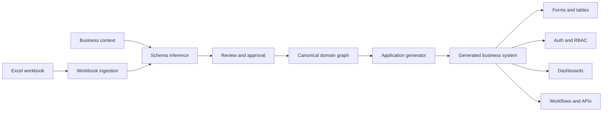

# byeExcel

> **excel2system** turns operational spreadsheets into reviewable, maintainable
> business applications.

[](#project-status)
[](https://jaclang.org/)
[](https://github.com/alvax64/byeExcel/actions/workflows/ci.yml)

Most small and medium-sized businesses already have software: their Excel
workbooks. Those files encode data models, business rules, relationships, and
day-to-day workflows—but they become difficult to validate, secure, automate,
and scale.

excel2system uses the workbook **and the user's business context** to propose a
structured application. The user reviews the inferred model before generation,
and the platform produces the repetitive parts of the system while preserving
room for business-specific behavior.

## Product vision

```text
Excel workbook + business context
                 ↓
      inferred domain model
                 ↓
       human review and edits
                 ↓
  generated, role-aware application
```

The generated system is intended to include:

- a structured data model derived from sheets, columns, and relationships;
- forms, tables, validation, search, and standard CRUD workflows;
- authentication and role-based access control (RBAC);
- dashboards and metrics based on the approved model;
- traceability from generated fields back to their spreadsheet source;
- an extension layer for custom rules that cannot be inferred safely.

excel2system is not meant to blindly convert every cell into code. Ambiguous
relationships, destructive changes, and security-sensitive decisions should
always require explicit user approval.

The complete product description and functional requirements are maintained in
[`docs/byeExcel_Product_Description_and_Functional_Requirements.md`](docs/byeExcel_Product_Description_and_Functional_Requirements.md).
The project submission rubric is available in
[`docs/jachacks-sf-2026-rubric.pdf`](docs/jachacks-sf-2026-rubric.pdf).

## How it works

1. **Ingest** — Read workbook metadata, sheet names, headers, types, formulas,
   and representative values.
2. **Understand context** — Ask the user what the workbook represents, who uses
   it, and which workflows matter.
3. **Infer** — Propose entities, fields, constraints, relationships, roles, and
   useful dashboard metrics.
4. **Review** — Present a model diff so the user can rename, link, reject, or
   confirm every important decision.
5. **Generate** — Create the application schema, UI, permissions, APIs, and
   dashboards from the approved model.
6. **Evolve** — Re-import later workbook versions and show safe, reviewable
   schema changes instead of silently overwriting the system.

## Proposed architecture



The canonical domain graph is the boundary between inference and generation.
The generator should consume an approved, versioned model—not raw inference
output. That keeps generation deterministic, testable, and auditable.

The detailed module boundaries, lifecycle invariants, Jac mapping, and decision
log live in [`docs/ARCHITECTURE.md`](docs/ARCHITECTURE.md).

## Why Jac

Jac is a strong fit because the product is both full-stack and graph-shaped:

- **Nodes** can represent workbooks, sheets, entities, fields, relationships,
  users, roles, and generated views.
- **Edges** can preserve provenance and express relationships such as
  `Sheet contains Field`, `Field references Entity`, and `Role can access View`.
- **Walkers** can implement ingestion, inference, validation, model migration,
  and generation as explicit traversals over the domain graph.
- **One full-stack project** can contain the server model, APIs, and client UI
  with shared types across boundaries.
- **Python interoperability** provides access to mature spreadsheet tooling
  while Jac owns the application model and orchestration.

### Recommended Jac template

The recommended starting point is the **`jac-shadcn` variant of `web-app`**:

```sh
jac create excel2system --use jac-shadcn
```

It provides the full-stack foundation needed by excel2system and adds
accessible, reusable UI primitives suitable for data tables, forms, dialogs,
navigation, and dashboards.

| Jac scaffold | Fit for excel2system |
| --- | --- |
| `jac-shadcn` | **Recommended**: full-stack plus a production-oriented component system |
| `web-app` | Valid minimal base, but more UI infrastructure must be built manually |
| `service` | Backend only; insufficient for the model-review and generated-app experience |
| `web-static` | Client only; no server persistence, ingestion, auth, or generation runtime |

Because this repository already exists, the scaffold should be generated in a
temporary directory and introduced through a focused PR rather than generated
over future project files.

## Proposed Jac domain model

The initial graph can be organized around these archetypes:

| Kind | Examples | Responsibility |
| --- | --- | --- |
| Nodes | `Workbook`, `Sheet`, `Entity`, `Field` | Source metadata and canonical schema |
| Nodes | `Role`, `View`, `Dashboard`, `Workflow` | Generated application behavior |
| Edges | `Contains`, `References`, `DerivedFrom` | Structure, relations, and provenance |
| Edges | `CanRead`, `CanWrite`, `CanExecute` | Approved access-control policy |
| Walkers | `IngestWorkbook`, `InferSchema` | Build a proposed model |
| Walkers | `ValidateModel`, `GenerateApplication` | Gate and materialize the approved model |
| Walkers | `DiffWorkbook`, `PlanMigration` | Safely evolve an existing generated system |

## Safety principles

- **Human approval before generation** — Inference proposes; the user decides.
- **No spreadsheet macro execution** — Treat uploaded workbooks as untrusted
  input.
- **Least privilege by default** — Generated roles start with the minimum
  required access.
- **Explain every relationship** — Preserve the evidence and user decision
  behind inferred links.
- **Preview migrations** — Never apply a destructive schema change without an
  explicit diff and confirmation.
- **Protect sensitive data** — Detect likely personal or confidential fields
  and require deliberate handling.
- **Keep custom code separate** — Regeneration must not overwrite manual
  business extensions.

## Project status

This public repository is at the **bootstrap stage**. It contains the runnable
official `jac-shadcn` scaffold, the architectural baseline, and reproducible CI
gates. Workbook ingestion, inference, generation, and production release claims
have not been implemented yet.

Suggested delivery milestones:

1. Scaffold the Jac `jac-shadcn` full-stack application.
2. Import `.xlsx` workbooks into a typed source model.
3. Build the canonical graph and model-review UI.
4. Generate the first CRUD module from an approved model.
5. Add authentication, RBAC, and provenance-aware audit logs.
6. Add dashboards, schema diffs, and safe regeneration.
7. Package a reproducible end-to-end example.

## Getting started

Install Jac `0.34.7`, then clone and start the development server:

```sh
git clone https://github.com/alvax64/byeExcel.git
cd byeExcel
jac install
jac start --dev main.jac
```

### Environment configuration

The repository includes a sanitized environment template:

```sh
cp secrets/byeexcel.env.example secrets/byeexcel.env
chmod 600 secrets/byeexcel.env
```

Fill in the local copy, source it before starting Jac, and never commit it:

```sh
. secrets/byeexcel.env
jac start --dev main.jac
```

- `JWT_SECRET` is required by the production server configuration.
- `ANTHROPIC_API_KEY` enables Anthropic-backed schema suggestions.
- `BYLLM_DEFAULT_MODEL` selects the byLLM model.

On Aule, the deployment-only file lives at
`/home/aule-admin/apps/byeexcel/secrets/byeexcel.env`; releases reference it
without copying secrets into Git or release archives.

Before opening a pull request, run the same local gates used by CI:

```sh
jac fmt . --check
jac check . --lint
jac build --check_only
jac build
```

## Contributing

Issues and pull requests are welcome while the architecture is taking shape.
Please keep early PRs focused and include:

- the user problem being solved;
- the model or graph change, if any;
- validation steps and tests;
- screenshots for user-facing changes;
- migration notes when generated data or schemas change.

Start with [the issue tracker](https://github.com/alvax64/byeExcel/issues) or
open a proposal before implementing a large generator or schema change.

## Naming

- **byeExcel** is the repository and project codename.
- **excel2system** is the product described in this README.
