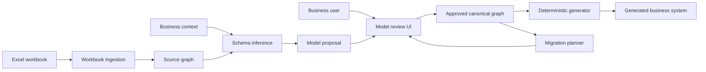

# byeExcel architecture

This document defines the architectural baseline for **excel2system**, the
product developed in the byeExcel repository. It describes boundaries and
invariants, not completed functionality. The current codebase is still the
official `jac-shadcn` bootstrap.

## Architectural goal

Turn an untrusted workbook plus user-supplied business context into a
reviewable, versioned domain model, then generate a deterministic business
application from the approved model.

The central rule is:

> Inference may propose a model, but only an approved canonical model may drive
> generation or migration.

That boundary keeps probabilistic interpretation away from deterministic code
generation and destructive data changes.

## System context



## Runtime shape

The MVP should be a modular monolith: one Jac full-stack application with clear
internal boundaries. This keeps deployment and transactions simple while the
domain model is still changing. A boundary may become a separate service only
after measurements show an independent scaling or reliability need.

| Module | Owns | Must not own |
| --- | --- | --- |
| Ingestion | Workbook parsing, source metadata, provenance | Business meaning or generated code |
| Inference | Candidate entities, links, confidence, evidence | Approval or production writes |
| Review | User decisions, conflicts, model diffs | Hidden automatic acceptance |
| Canonical model | Approved entities, fields, relations, roles, versions | Raw spreadsheet cells |
| Generation | Deterministic templates and generation manifest | Model inference |
| Migration | Version diff, compatibility checks, execution plan | Unreviewed destructive changes |
| Platform | Auth, RBAC, audit, jobs, storage, observability | Workbook-specific business rules |
| Extensions | Hand-written customer rules and integrations | Generated files that regeneration replaces |

Dependencies point inward toward stable contracts:

```text
UI / API
    ↓
application walkers
    ↓
canonical domain model
    ↑
adapters (Excel, persistence, generated output)
```

Inference and ingestion are adapters to the canonical model. The generator is
a consumer of that model. They do not call one another through hidden shared
state.

## Model lifecycle

Every import moves through explicit states:

```text
uploaded → profiled → proposed → under_review → approved → generated
                                      │
                                      └──────────────→ rejected
```

- `uploaded` and `profiled` data are immutable evidence for one import.
- `proposed` models include confidence and provenance for every inferred link.
- `approved` models have an immutable version identifier and approver record.
- `generated` output records the model version, generator version, and file
  hashes in a generation manifest.
- A later workbook creates a new proposal and migration plan; it never mutates
  an approved version in place.

## Jac mapping

| Jac construct | Initial responsibility |
| --- | --- |
| Nodes | `Workbook`, `Sheet`, `SourceColumn`, `Entity`, `Field`, `Role`, `View` |
| Edges | `Contains`, `Proposes`, `References`, `DerivedFrom`, `CanAccess` |
| Walkers | `IngestWorkbook`, `InferSchema`, `ValidateProposal`, `ApproveModel` |
| Walkers | `GenerateApplication`, `DiffModel`, `PlanMigration` |
| Abilities | Validation and policy that belong to one graph archetype |

Walkers coordinate use cases. Domain invariants belong to the graph types they
protect. File, database, and external-API access stays behind adapters so core
walkers can be tested with fixtures.

## Stable contracts

The first implementation should formalize these contracts before adding broad
UI functionality:

1. **Source graph** — lossless workbook structure and provenance.
2. **Model proposal** — candidate domain graph with evidence and confidence.
3. **Approved model** — versioned canonical graph accepted by a user.
4. **Generation manifest** — reproducible record of inputs and generated
   artifacts.
5. **Migration plan** — ordered, classified changes with rollback metadata.

The generator must produce the same manifest and output hashes for identical
approved input, generator version, and configuration.

## Security and safety invariants

- Treat workbook contents, formulas, filenames, and embedded objects as
  untrusted input.
- Never execute workbook macros.
- Put upload limits and decompression limits ahead of parsing.
- Redact representative values before sending context to an external model.
- Require explicit approval for inferred relationships, roles, and destructive
  migrations.
- Deny access by default; generated RBAC only grants reviewed permissions.
- Keep generated code separate from extension code so regeneration cannot
  overwrite hand-written behavior.
- Record the actor, source version, model diff, and generator version for every
  approval and generation event.
- Production deployments must replace Jac's development JWT secret and either
  disable the default admin portal or provision unique credentials before
  exposure.

## Repository evolution

Create packages only when their first behavior lands; avoid empty architecture
folders. The intended direction is:

```text
components/          shared client UI
domain/              canonical graph types and invariants
ingestion/           workbook adapters and source profiling
inference/           proposal construction
generation/          deterministic emitters and manifests
migrations/          model diff and migration planning
platform/            auth, RBAC, audit, jobs, storage
tests/               fixtures, unit, contract, and end-to-end tests
main.jac             composition root
```

`main.jac` is the composition root. It may wire modules together, but business
rules should move into the owning module as they are introduced.

## Quality gates

The GitHub Actions workflow pins the Jac Linux binary and verifies its SHA-256
before execution. A pull request must then pass:

1. dependency installation;
2. formatter check;
3. Jac lint;
4. whole-program type/build gate;
5. sealed `.jab` build;
6. HTTP smoke test against the sealed application.

Domain tests become mandatory with the first domain behavior. The intended test
pyramid is:

- unit tests for graph invariants and pure transformations;
- contract tests for workbook and persistence adapters;
- golden tests for deterministic generation manifests;
- migration tests for forward, failure, and rollback paths;
- a small end-to-end path from workbook fixture to reviewed CRUD output.

## Decision log

| Decision | Status | Rationale |
| --- | --- | --- |
| Approved canonical graph separates inference from generation | Accepted | Makes generation deterministic and auditable |
| Modular monolith for the MVP | Accepted | Minimizes operational complexity while boundaries evolve |
| Versioned, immutable approved models | Accepted | Enables diffs, audit, rollback, and regeneration |
| Generated and extension code remain separate | Accepted | Protects customer customization |
| Async job infrastructure deferred until workloads require it | Proposed | Avoids premature distributed coordination |

Material changes to these decisions should be made through a focused
architecture PR that updates this log and includes migration impact.
